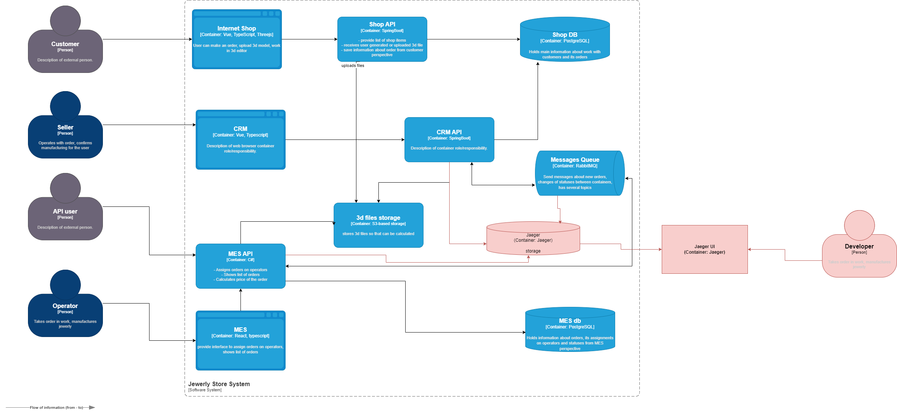

**Мотивация**

**Зачем нужен трейсинг**

**Выявление узких мест**

Заказы зависают из-за долгого расчета стоимости в MES (до 30 минут) или потери сообщений в RabbitMQ. Трейсинг покажет, на каком этапе происходит задержка.

**Диагностика потерь данных**

Клиенты не получают заказы — возможно, сообщения теряются при интеграции CRM ↔ MES через RabbitMQ.

**Прозрачность для бизнеса**

Операторы не видят актуальные заказы из-за медленной загрузки MES. Трейсинг поможет найти проблемы с запросами к БД.

**Сокращение времени на расследование**

Вместо ручного аудита логов — автоматическая визуализация пути заказа.

**Метрики**

**Технические**

- Время обработки заказа на каждом этапе (например, от SUBMITTED до PRICE_CALCULATED).
- Количество ошибок в интеграционных точках (RabbitMQ, API).
- Задержки в чтении/записи БД.

**Бизнес-метрики**:

- среднее время выполнения заказа (от INITIATED до SHIPPED)
- процент заказов, завершенных вовремя

---

**Предлагаемое решение**

**Технологии**

**Инструмент трейсинга**

Jaeger или Zipkin (open-source, поддержка распределенных систем).

**Интеграция**:

**Java-сервисы (Shop API, CRM API)**

Добавить OpenTelemetry SDK.

**C#-сервис (MES API)**

Использовать OpenTelemetry для .NET.

**RabbitMQ**

Настроить трейсинг через плагин (например, opentelemetry-rabbitmq).

**Базы данных**

Добавить трейсы для SQL-запросов через OpenTelemetry.

---
**Компромиссы**

**Проприетарный MES**

Если код MES закрыт, внедрение трейсинга потребует доработки через прокси-сервис.

**Нагрузка** 

Трейсинг увеличит нагрузку на сеть и CPU (решение: выборка трейсов — 10% заказов).

**Сложность** 

Интеграция с RabbitMQ и S3-хранилищем может потребовать дополнительных ресурсов.

---
**Безопасность**

**Шифрование** 

Трейсы передаются по TLS

**Аутентификация**

Доступ к Jaeger только через VPN и SSO

**RBAC**
- операторы - просмотр трейсов своих заказов
- админы - полный доступ

**Маскирование данных**

Чувствительные поля (например, емаил клиента) не сохраняются в трейсах.