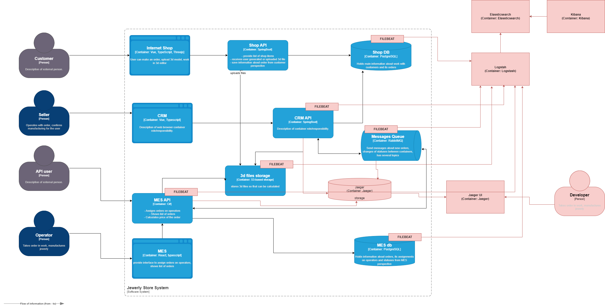

## Мотивация

- **Снижение времени на диагностику**: логи позволят быстро идентифицировать причины сбоев без опоры на субъективные описания клиентов.
- **Улучшение прозрачности процессов**: отслеживание статусов заказов в режиме реального времени.
- **Снижение нагрузки на поддержку**: автоматизация анализа ошибок сократит ручную работу.
- **Повышение качества API**: выявление узких мест и аномалий в работе интеграций.
- **Поддержка SLA**: гарантия выполнения обязательств перед B2B-партнерами.

**Технические и бизнес-метрики**
1. Среднее время восстановления (MTTR) после сбоя.
2. Количество жалоб клиентов на "потерянные" заказы.
3. Время расчета стоимости заказа в MES.
4. Уровень доступности API для партнеров.
5. Процент успешных операций изменения статусов.

---

## Необходимые логи (уровень INFO)

### Онлайн-магазин
- Изменение статуса заказа (время, ID заказа, старый/новый статус, ID пользователя).
- Загрузка 3D-файла (ID файла, размер, тип, ошибки валидации).
- Отправка заказа в SUBMITTED (время, ID заказа, способ создания модели).

### MES
- Расчет стоимости (время старта/окончания, ID заказа, кол-во полигонов).
- Изменение статусов производства (MANUFACTURING_STARTED, COMPLETED и т.д.).
- Ошибки обработки 3D-моделей (ID файла, тип ошибки).

### CRM
- Подтверждение заказа (MANUFACTURING_APPROVED: ID менеджера, время).
- Ручные изменения статусов (кто, когда, предыдущее/новое значение).

### RabbitMQ
- Сообщения между системами (тип события, отправитель, получатель, статус доставки).

### API Gateway
- Входящие запросы (метод, путь, статус ответа, время выполнения).
- Ошибки аутентификации/авторизации.

---

## Уровни логирования
- **WARN**
    - Повторные попытки расчета стоимости.
    - Задержки в обработке > 15 мин.
    - Подозрительные API-запросы (например, частые проверки статуса).

- **ERROR**
    - Сбои при сохранении заказов в БД.
    - Потеря сообщений в RabbitMQ.
    - Ошибки валидации 3D-моделей.

- **DEBUG**
    - Детализация расчетов стоимости (только для dev-окружения).
    - Трассировка распределенных транзакций.

---

## Приоритеты внедрения
1. **MES API** и **CRM API** - ключевые точки, где происходят критические бизнес-процессы.
2. **RabbitMQ** - центральный элемент интеграции, необходим для анализа задержек.
3. **Онлайн-магазин** - основная точка контакта с конечными клиентами.

Причина -  эти компоненты непосредственно влияют на основные жалобы (потеря заказов, задержки расчетов).

---

## Предлагаемое решение

### Технологии
- **ELK Stack** (Elasticsearch, Logstash, Kibana) - централизованный сбор и визуализация.
- **Prometheus + Grafana** - метрики производительности (время ответа API, нагрузка на БД).
- **Distributed Tracing** (Jaeger) - для отслеживания транзакций между микросервисами.

## Политики
**Безопасность**

Маскировка персональных данных (телефоны, email) в логах.

RBAC: доступ к логам только для DevOps и L3-поддержки.

**Хранение**

- 30 дней - "горячее" хранение в Elasticsearch.
- 1 год - архивация в S3 с холодным доступом.
- Отдельные индексы для каждого сервиса.

## Анализ и алертинг
**Аномалии**

- резкий рост ошибок 500 в API (>5% за 5 мин).
- необычная активность (например, 1000+ SUBMITTED заказов за 1 мин).

**Автоматизация**

- алерты в Kibana при статусах "CLOSED" без "SHIPPED".
- уведомления о длительных (>30 мин) расчетах стоимости.

